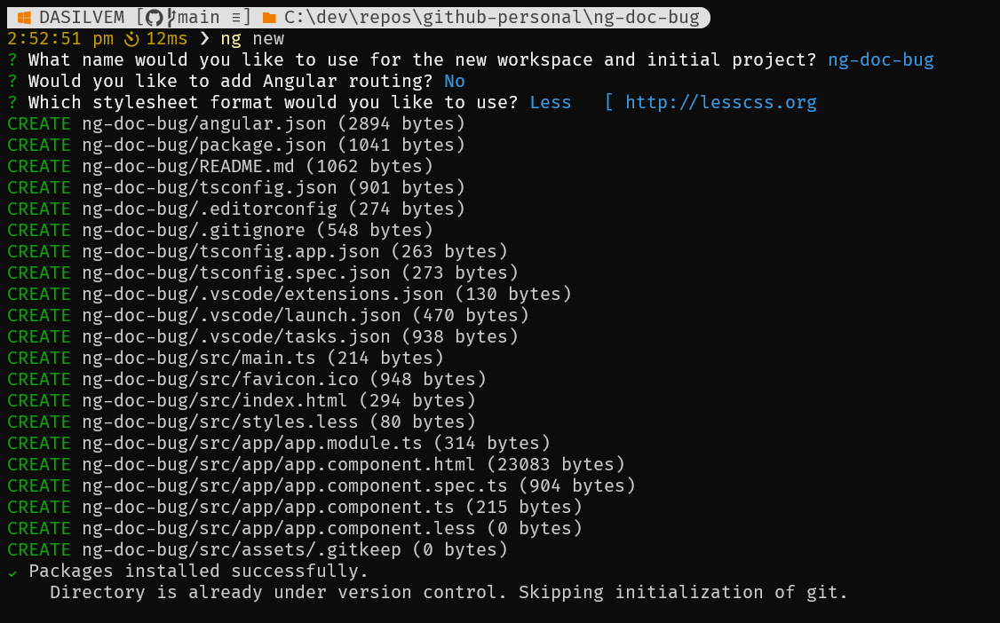
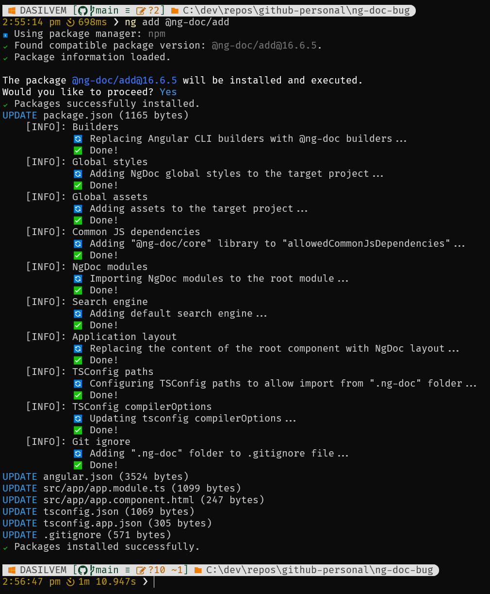
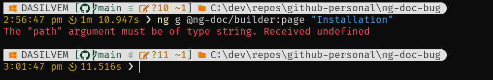

# NgDoc repro repo for bug #71

This is a repro repo for ng-doc/ng-doc#71.

## Steps to reproduce the bug

1) `ng new` to create an app:

2) `ng add @ng-doc/add` to add NgDoc:

3) `ng g @ng-doc/builder:page "Installation"` to add a page:
  

## More info about my system

### Angular CLI version

`ng version`

> Angular CLI: 16.1.2  
> Node: 16.19.1  
> Package Manager: npm 9.6.7  
> OS: win32 x64  
>
> Angular: 16.1.2  
> ... animations, cli, common, compiler, compiler-cli, core, forms  
> ... platform-browser, platform-browser-dynamic, router  
>
> Package                         Version
> ---------------------------------------------------------
> @angular-devkit/architect       0.1601.2  
> @angular-devkit/build-angular   16.1.2  
> @angular-devkit/core            16.1.2  
> @angular-devkit/schematics      16.1.2  
> @schematics/angular             16.1.2  
> rxjs                            7.8.1  
> typescript                      5.1.5  

### Powershell version

`pwsh -v`

> PowerShell 7.3.5

### OS build

In powershell run `[System.Environment]::OSVersion`

> Platform: Win32NT  
> Version: 10.0.19045.0  
> VersionString: Microsoft Windows NT 10.0.19045.0  

Info from about system page:

> Edition	Windows 10 Enterprise  
> Version	22H2  
> Installed on 08/03/2023  
> OS build	19045.3086  
> Experience	Windows Feature Experience Pack 1000.19041.1000.0  
